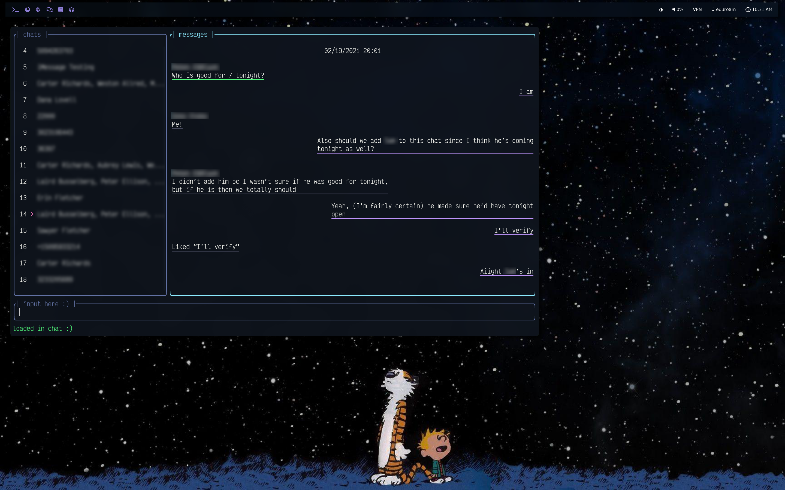

# SMCurser

A tui client for [SMServer](https://github.com/ianwelker/smserver), written in Rust using the [tui-rs framework](https://github.com/fdehau/tui-rs). This is a rewrite of [SMServer_receiver](https://github.com/iandwelker/smserver_receiver), but using Rust, fixing a lot of issues, and adding a lot of features.


SMCurser running on my desktop

## Features
- Browse and send texts and files from iMessage, all from your terminal
- Send tapbacks, delete conversations and texts, compose new conversations, and more
- SMCurser displays typing indicators from other parties in real time
- Ability to create and use custom colorschemes
- Extremely fast and low memory usage
- Optional configuration file for persistent customization
- Many more goodies to significantly increase quality and ease of use

## Planned future features
- Sending typing indicators when you start typing
- Ability to specify websocket/API subdirectory to connect to if running SMServer over a proxy
- Have something else you'd like added? File an issue or PR and I'll take a look at it :)

## To Build and Install
You can download a fairly up-to-date version of SMCurser from the `Releases` section of this repository. However, it may not have all the latest features and updates, so I'd recommend building it from source with the following steps:

First, install the official rust toolchain. If you don't know how to do this, visit [rustup.rs](https://rustup.rs) and follow the instructions there.

Once you've got that completely installed, do the following:
```sh
git clone https://github.com/iandwelker/smcurser.git
cd smcurser
cargo build --release
```

The compiled binary will reside at `./target/release/smcurser`

## To run
First, get a copy of [SMServer](https://github.com/ianwelker/smserver) and start that running. \
Then, if youre on linux or macOS, run:
```sh
smcurser --host "<your phone's ip address>"
```

Or, if you're on Windows, run:
```sh
smcurser.exe --host "<your phone's ip address>"
```
